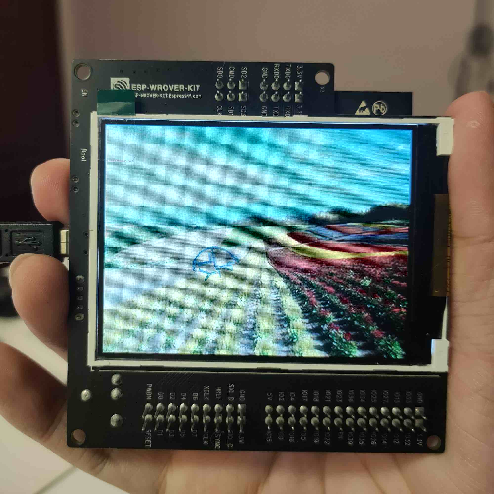
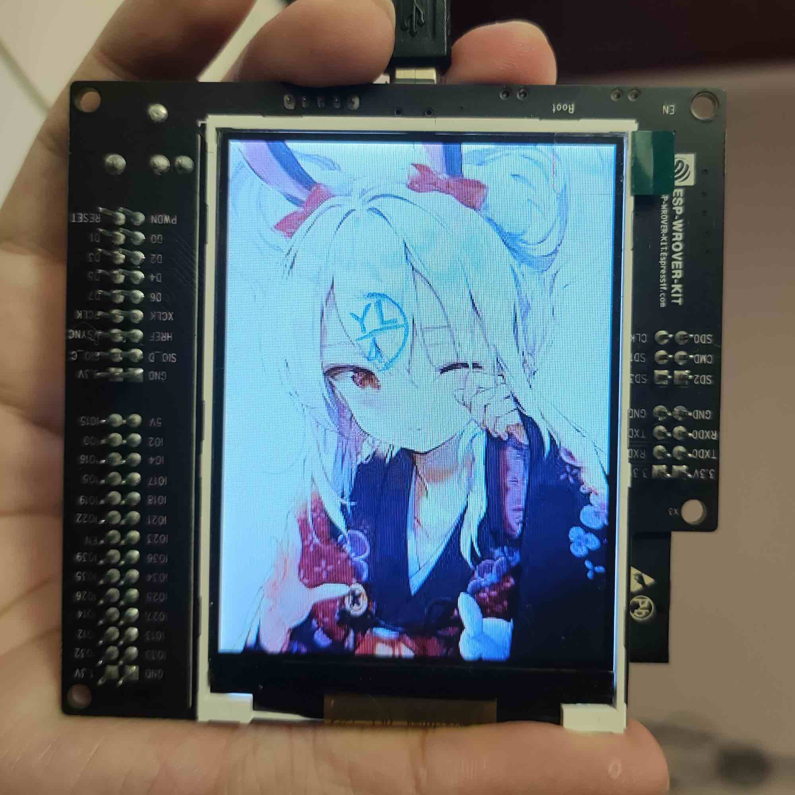

# ESP32 Wrover LCD Usage

> This is a Arduino Library for **ESP32 Wrover Kit**.
>
> In `image generator` file, you can find the code to generate `jpeg.h` code for `jpegtest` at **Example**.

## Usage of image-generator

``` python 
python img2code.py girl
```

output:

```shell
Image Name girl.jpg
Succeed!
```

And a file ` girl.h` will show in the same folder.

---

## How it looks

> 

---

## How to use

To download. click the DOWNLOADS button in the top right corner, rename the uncompressed folder WROVER_KIT_LCD. Check that the WROVER_KIT_LCD folder contains WROVER_KIT_LCD.cpp and WROVER_KIT_LCD.

Place the WROVER_KIT_LCD library folder your arduinosketchfolder/libraries/ folder. You may need to create the libraries subfolder if its your first library. Restart the IDE

Also requires the Adafruit_GFX library for Arduino.

---


> **OLD_DESCRIPTIONS**
>
> This is a library for the Adafruit ILI9341 display products
>
> This library works with the Adafruit 2.8" Touch Shield V2 (SPI)
>   ----> http://www.adafruit.com/products/1651
>
> Check out the links above for our tutorials and wiring diagrams.
> These displays use SPI to communicate, 4 or 5 pins are required
> to interface (RST is optional).
>
> Adafruit invests time and resources providing this open source code,
> please support Adafruit and open-source hardware by purchasing
> products from Adafruit!
>
> Written by Limor Fried/Ladyada for Adafruit Industries.
> MIT license, all text above must be included in any redistribution


